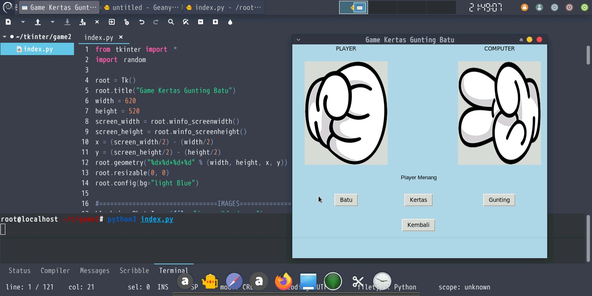

# KGB
source code game rock paper scissors using tkinter python

<p align="center">
  <a name="top" href="#octocat-hi-there-thanks-for-visiting-">
     
  </a>
</p>

# Info

<p align="center">

 <a href="https://github.com/AsukaDev-Official">
    
  </a>
<a href="https://github.com/AsukaDev-Official/followers">
  </a>
<a href="https://github.com/AsukaDev-Official/Anime-Tracker/stargazers/">
<a href="https://github.com/AsukaDev-Official">
  
</a>
<a href="https://github.com/AsukaDev-Official">
  
</a>
<a href="https://github.com/AsukaDev-Official">
  
</a>
<a href="https://github.com/AsukaDev-Official">
  
</a>
</div>
</p>

##
### :octocat: Hi, thanks for spending your time visiting this repository !
<p>
This is Program rock paper scissors game using tkinter python
</p>


# Installation
<details open>
<summary> pydroid (Android) / Linux</summary>

- ```bash
  $ apt update && apt upgrade
  ```

- ```bash
  $ apt install python3 git python3-tk -y
  ```

- ```bash
  $ git clone https://github.com/AsukaDev-Official/KGB
  ```

- ```bash
  $ cd KGB
  ```

- ```bash
  $ python3 index.py
  ```
